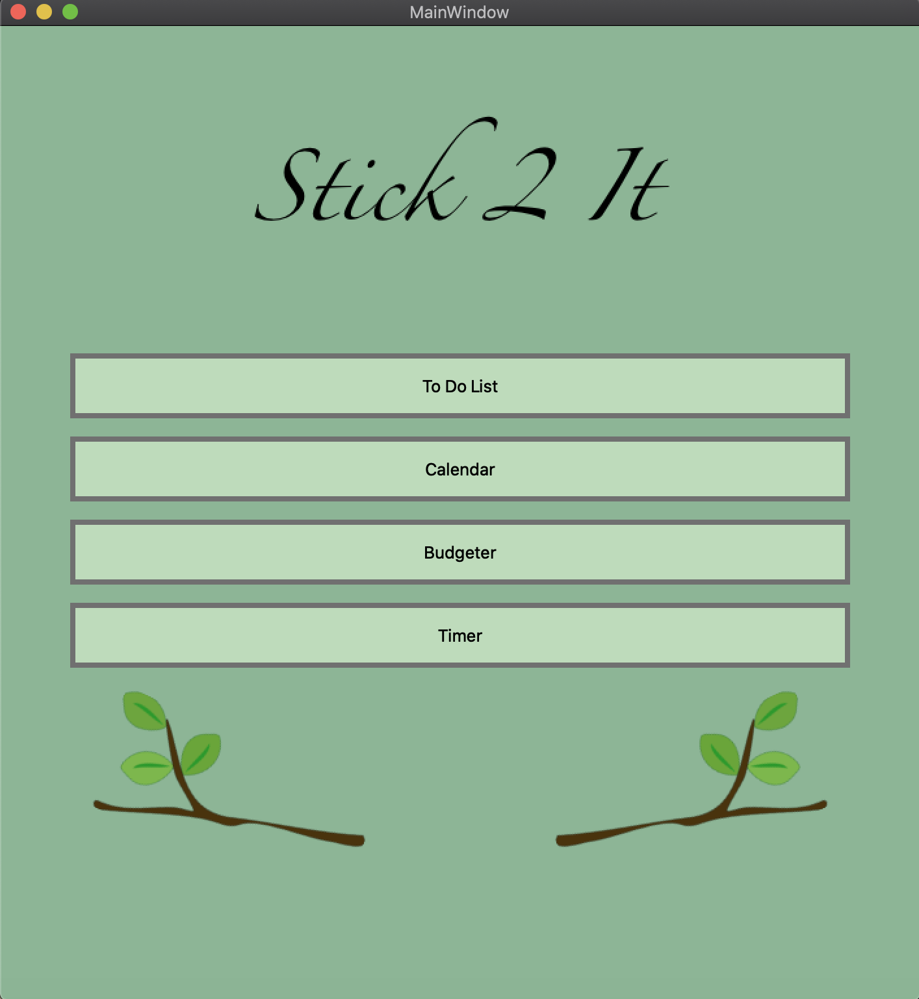

# Stick2It
*a lifestyle app to help improve organization and productivity*

Stick2It is the final project for our third year software engineering class.  We were tasked with creating a useful product within our groups.  This project was conceived as a simple, yet pratical project.

### Tech Stack and Methodology
Working within a group, Python seemed like an ideal languageas as it is known for being easy to pick to as well as being extremly versitile.  Using PyQt to build our GUI was new for all members and a hurdle, but in the end was the best choice for quickly creating a useable user interface.

### Walkthrough
Stick2It is a modular desktop application that bundles a handful of useful productivity widgets into one conveient package.  Included is: a (non-volitile) To Do List, Calender (which counts how many days are left in between a specified date and the current date), a budgeter, and a timer.

### Takeaway
Working in an iterative style along side group members was a new technique for all of us to learn.  In hindsight we did a pretty good job at managing and distributing work, keeping agile, and working collabortivly over GitHub.  The size and scope of the project was small and simple, but that was the plan to allow ourselves room to learn and adapt to this new methodlogy of building software as a team.

